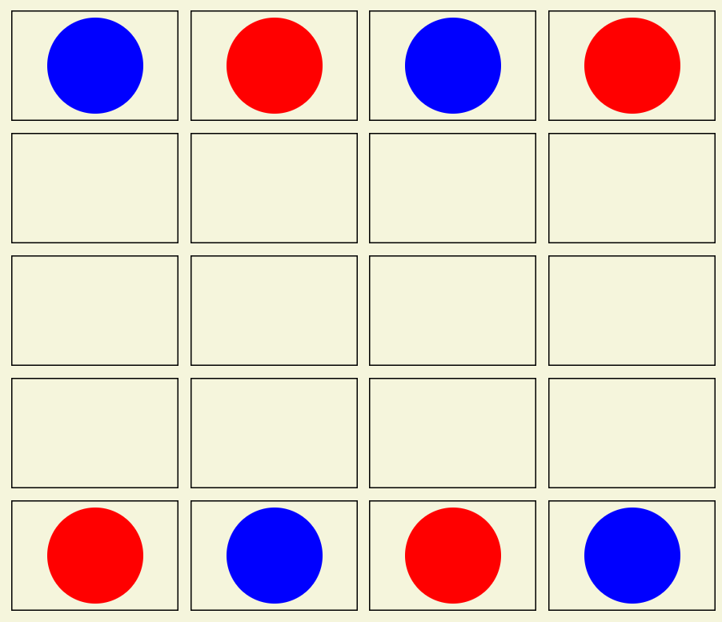

# TWO PLAYER BOARD GAME

The game is played by two players.

Consider a game board consisting of 5 rows and 4 columns. The game is played with 4 blue stones and 4 red stones. Initially, the stones are arranged on the board as follows:

Players move in turn, the first player plays with the red stones, the other with the blue stones. In a move, a player must move one of his or her stones by one square to an empty square, either horizontally or vertically. The winner is the player who first forms an unbroken chain of three stones of his or her color horizontally, vertically, or diagonally.

An example game play could be given as:

PLAYER_2' move [from]: 0 0 >>>
PLAYER_2' move [to]: 1 0

PLAYER_1' move [from]:  0 3 >>>
PLAYER_1' move [to]: 1 3

PLAYER_2' move [from]: 0 2 >>>
PLAYER_2' move [to]: 1 2

PLAYER_1' move [from]: 0 1 >>>
PLAYER_1' move [to]: 0 2

PLAYER_2' move [from]: 4 1 >>>
PLAYER_2' move [to]: 3 1

PLAYER_1' move [from]: 0 2 >>>
PLAYER_1' move [to]: 0 3

PLAYER_2' move [from]: 3 1 >>>
PLAYER_2' move [to]: 2 1

PLAYER_1' move [from]: 4 2 >>>
PLAYER_1' move [to]: 3 2

PLAYER_2' move [from]: 2 1 >>>
PLAYER_2' move [to]: 1 1

PLAYER_1 won